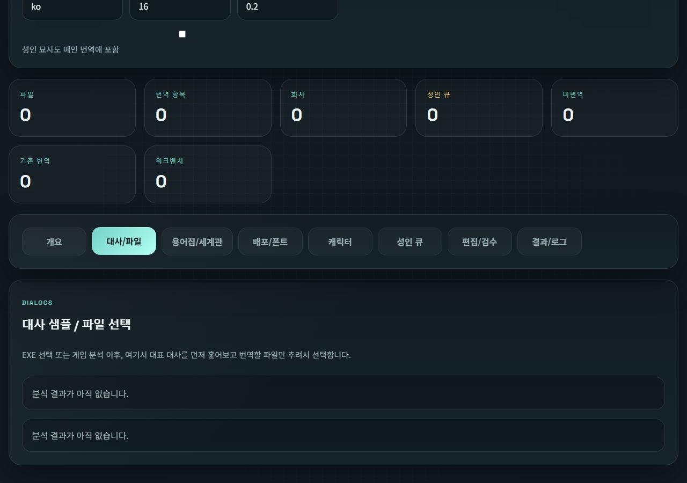

# Ren'Py Translation Workbench

AI-assisted translation workbench for Ren'Py projects with character-aware tone controls, world and glossary management, adult-queue review, manual editing, and direct Ren'Py-ready output generation.

Korean documentation: [README.ko.md](README.ko.md)

License: Apache-2.0  
Copyright (c) 2026 cyy1133

## Release Summary

- Scans a Ren'Py game from the selected `.exe` and extracts translatable script blocks.
- Supports both `translation_layer` mode (`game/tl/<lang>`) and source fallback mode (`game/*.rpy`).
- Groups dialogue by character and lets you tune role, tone, notes, world settings, protected terms, and glossary rules.
- Provides sample tone previews before full translation.
- Separates adult-sensitive lines into a dedicated review queue.
- Lets you manually edit translated lines and apply them back to the game immediately.
- Generates workbench output and, when supported, a publishable Ren'Py language bundle.

## Main Workflow

1. Launch `Start.bat`.
2. Open `WebUI.HTML`.
3. Select the game `.exe` or paste the executable path.
4. Run the `Analyze Game` action.
5. Review the tabs:
   - `Overview`: overall project inference
   - `Dialogue / Files`: file list and dialogue preview
   - `Glossary / World`: glossary, protected terms, world notes
   - `Publish / Fonts`: publish language and font plan
   - `Characters`: character roster, tone presets, and sample preview workflow
   - `Adult Queue`: adult-sensitive lines separated for review
   - `Editor / QA`: source/translation side-by-side editor
   - `Results / Logs`: translation results, checkpoints, and runtime logs
6. Start translation or review lines manually.

## User Guide & Screenshots

The following walkthrough details how each part of the Ren'Py Translation Workbench operates. You can seamlessly switch between tabs without losing your progress.

### 1. Overview & API Settings (개요)

The Overview tab is the starting point for setting up your environment.
- **API Configuration:** Select your AI provider (Google Gemini or OpenAI) and securely enter your API key. The UI clearly shows the active state of your key.
- **Quick Modes:** Offers one-click presets like 'Recommended' (balance of quality and cost), 'Budget Mode' (faster and cheaper), or 'Style Experiment' to automatically configure batch sizes, delays, and models.
- **Source Selection:** Input the path to the game's `.exe` or upload extracted `.rpy` files. Clicking "Analyze Game" extracts the script blocks.

### 2. Dialogs / Files (대사/파일)

This tab gives you a granular view of the project's payload.
- **File Selection:** Pick specific `.rpy` files you want to include in the active translation batch.
- **Dialogue Preview:** Browse the extracted lines to review the context and source text before passing it to the AI.
- **Scope View:** It shows exactly how many dialogues are un-translated compared to those translated by the game or by the workbench.

### 3. Glossary / World (용어집/세계관)

A critical tab to maintain translation consistency across massive scripts.
- **World & Tone Rules:** Input background era (e.g., modern rural coastal town, romance/fantasy themes), overall tone guidelines (e.g., preserving local rustic dialect), and formatting preservation rules (e.g., leaving Ren'Py tags strictly alone).
- **Protected Terms:** List character names (Grace, Marion, Malcolm, etc.) or locations that the AI should never translate.
- **Glossary Table:** Define specific source-to-target word mappings to guarantee consistency.

### 4. Publish / Fonts (배포/폰트)

If you use the `translation_layer` mode, you can configure how the result looks in-game.
- **Bundle Options:** Set the language code (e.g., `ko_workbench`) to generate a fully formatted Ren'Py language pack `tl` folder.
- **Font Presets:** Built-in font coordination presets (like 'Balanced Korean', 'Novel Type', 'Bold Type') automatically map appropriate Korean fonts to Dialogues, Names, UI, and System texts with one click.
- **Font Scaling:** The workbench calculates math to automatically adjust the target font scale comparing it against the original font (e.g., Dialogue at 1x, Name at 0.96x) so text bounds aren't broken.

### 5. Characters Workbench (캐릭터)

This workbench isolates character speech so you can tailor the AI's persona.
- **AI Persona Inference:** After analysis, the AI automatically infers the character's narrative importance (e.g., 'Main Character') and tonal nuance (e.g., 'Romantic/Sensual').
- **Tone Presets:** Apply pre-defined tones like "Cold and Direct" or "Playful / Seductive" to specific characters, and append manual notes (e.g., "Do not soften her directness.")
- **Sample Tuning:** Retranslate only 5-6 sample lines for that specific character to test the preset before committing to the full translation. This iterative preview loop saves massive amounts of money and time.

### 6. Adult Queue (성인 큐)

A safety and compliance feature.
- **Isolated Lines:** Any dialogue triggering adult-content keywords (e.g., 'breast') is separated from the main AI batch.
- **Context & Manual Overview:** Safely review the sexually explicit or sensitive line alongside the previous and next lines of context. You can manually translate these within the editor text area and click "Save This Line" to bypass AI censorship filters completely.

### 7. Editor / QA (편집/검수)

A built-in side-by-side translation editor.
- **Live Updating:** Open any `.rpy` file and see the source text next to its translation.
- **Status Filters:** Show only missing translations, or filter by adult queue and AI-generated lines.
- **Immediate Save:** Saving a row updates the staging files immediately, making QA directly impactful without re-running scripts.

### 8. Results / Logs (결과/로그)

The operational heart for running the actual translation jobs.
- **Rule Selection:** Choose whether to translate only missing strings or force a total re-translation.
- **Execution:** Hit "Translate" to dispatch the lines to the LLM.
- **Live Logging:** Monitor the batch progress, API latency, retries, and errors in real time. 

## Character Tone Workflow

The fastest correction loop is built around sample previews:

1. Open a character in the `Characters` tab.
2. Review the extracted sample lines.
3. Compare the current preset against alternatives.
4. Run sample preview translation before committing to a full pass.
5. Confirm the tone only after the preview lines feel right.
6. Translate the selected files.

This is usually cheaper and faster than translating everything first and redoing large batches later.

## Manual Review and Editing

### Adult Queue

- Shows lines flagged by the adult-content classifier or separated by workflow rules.
- Displays source text, context, current connected translation, and a direct-edit textarea.
- `Open in Editor` jumps to the same item in the file editor.
- `Save This Line` writes the manual translation to the current workbench output immediately.

### Editor / QA Tab

- Opens a file as a source/translation pair view.
- Supports filtering by translation state.
- Keeps source text, connected translation, and editable translation visible.
- `Save Current Line` writes one row.
- `Save Changes` writes all dirty rows in the current file.

## Translation Modes

### New Translation

Translate only untranslated lines in the current scope.

### Retranslation

Re-run existing translated lines only. This is useful for tone upgrades or character-specific rewriting.

### Force All

Translate the whole selected scope again from scratch.

### Character-only Retranslation

Retranslate only one selected character across the currently selected files.

## Provider Support

### Gemini API

- Recommended default: `gemini-2.5-flash`
- Budget mode: `gemini-2.5-flash-lite`
- Dynamic chunking uses both item-count and character-budget planning

### OpenAI OAuth / Codex CLI

- Supports local Codex CLI execution without API key entry in the UI
- Includes automatic checkpointing and resume metadata
- Uses larger document-aware chunking for cheaper long-form jobs

## Output Layout

### Translation Layer Mode

- Staging output: `game/tl/<lang>_ai/...`
- Publish bundle: `game/tl/<publish_language_code>/...`
- Publish config: `zz_workbench_language_config.rpy`

### Source Fallback Mode

- Workbench output: `game/_translator_output/<lang>_source/...`
- Adult review queue: `adult_review.json`
- Translation logs: `game/_translator_logs/{analysis_mode}/{lang}/{session_id}/...`

## Repository Notes

- `RBackend.py`: backend analysis, provider integration, translation pipeline, manual-edit routes
- `WebUI.HTML`: app shell and tab layout
- `webui.js`: state management, interaction logic, sample preview flow, manual-edit flow
- `webui.css`: responsive layout and workbench styling
- `docs/screenshots/`: release screenshots used in this README

## License

This project is released under the Apache License 2.0. See [LICENSE](LICENSE) and [NOTICE](NOTICE).
