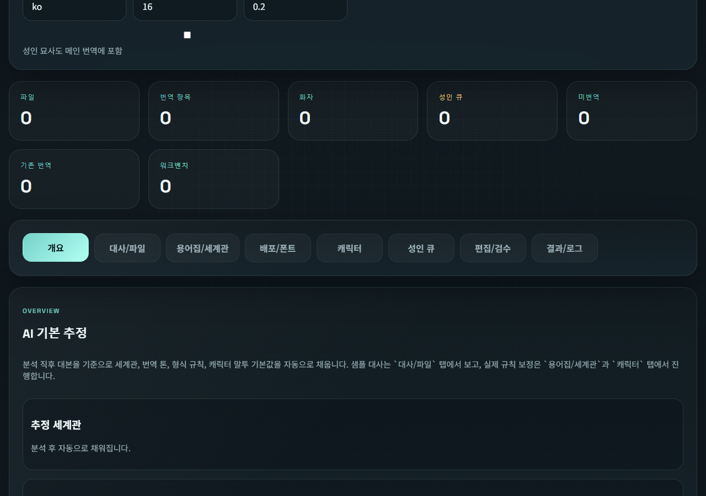
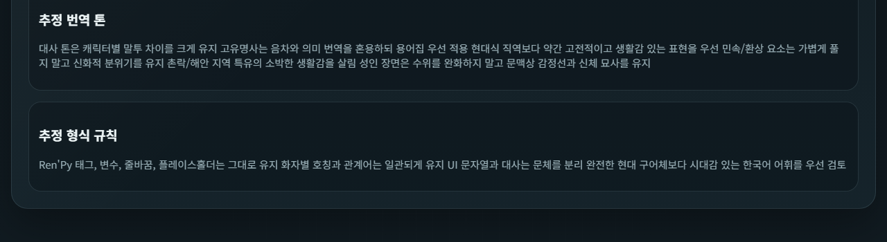
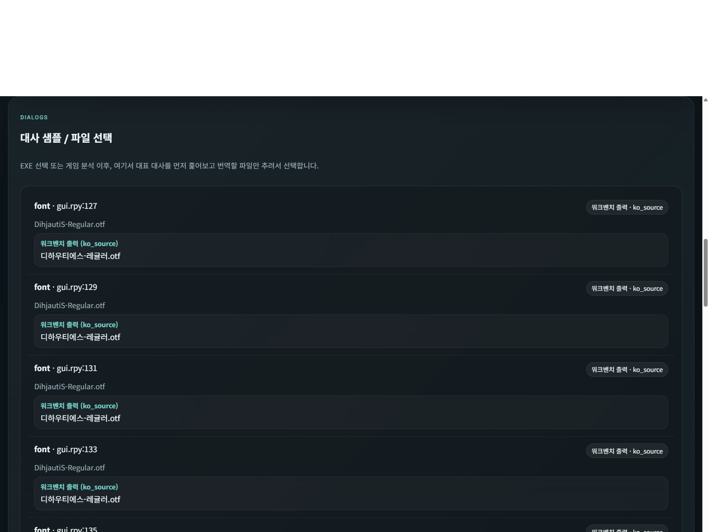
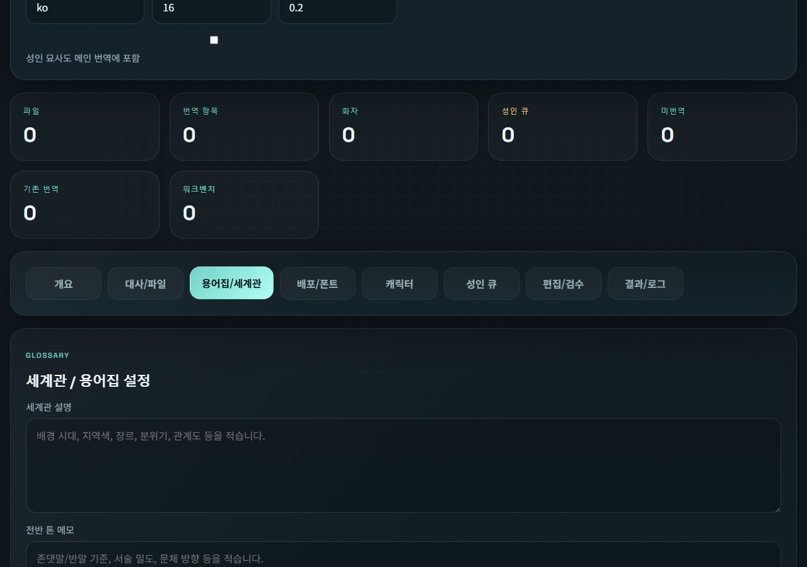
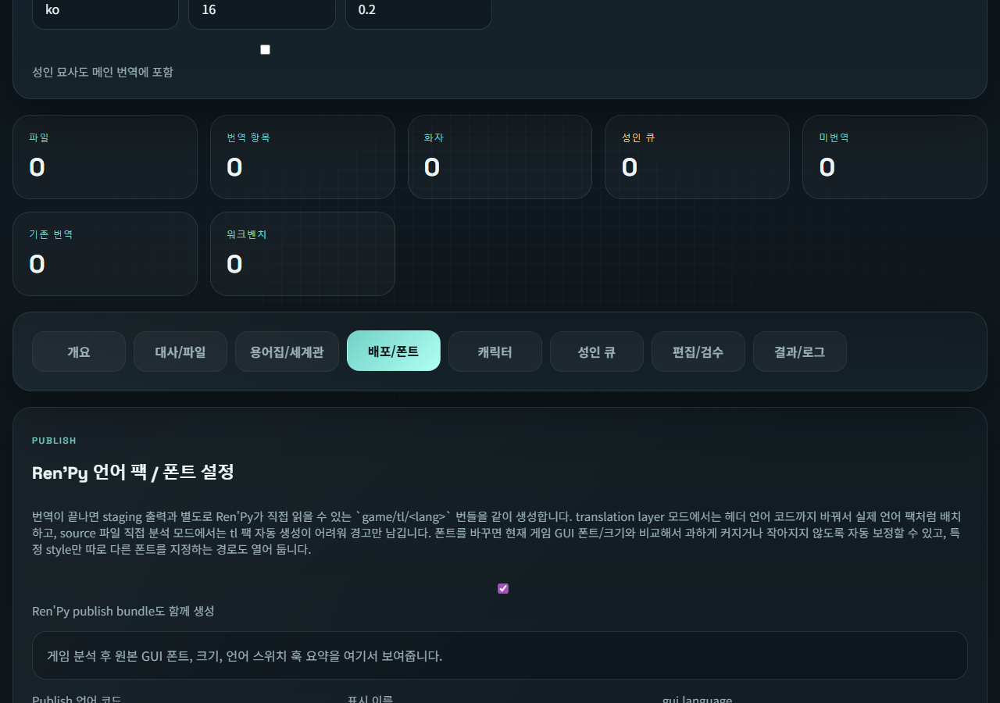
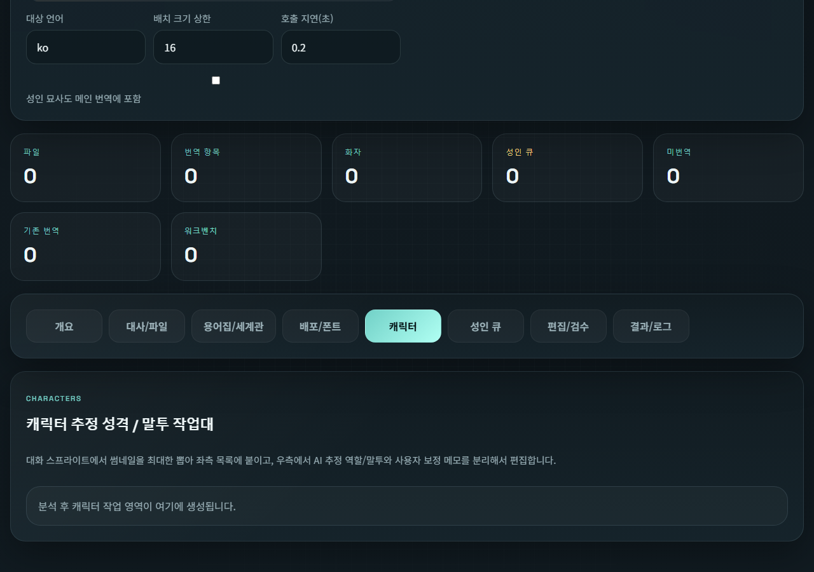
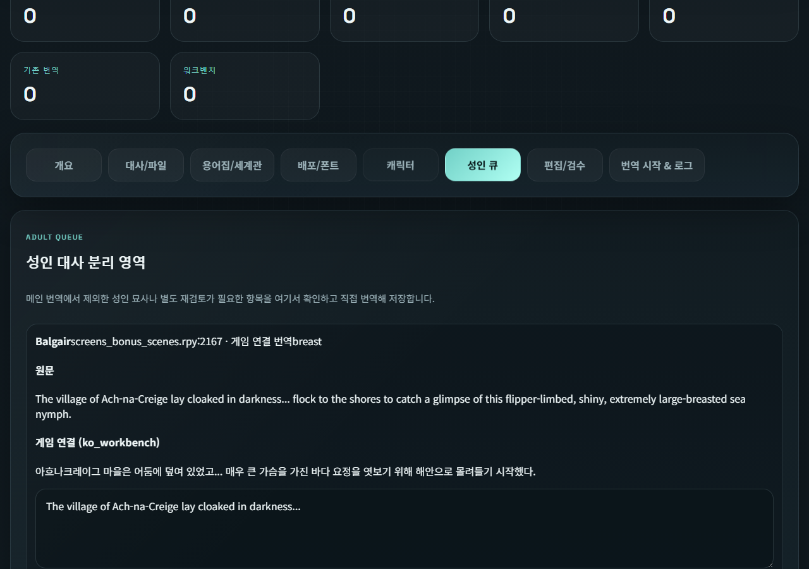
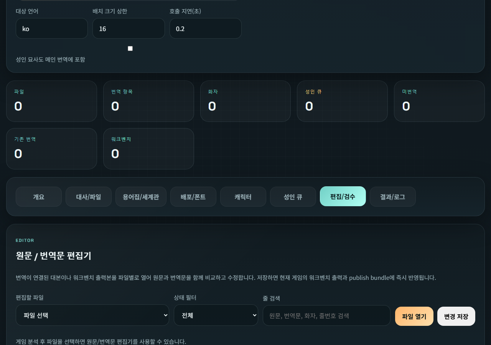
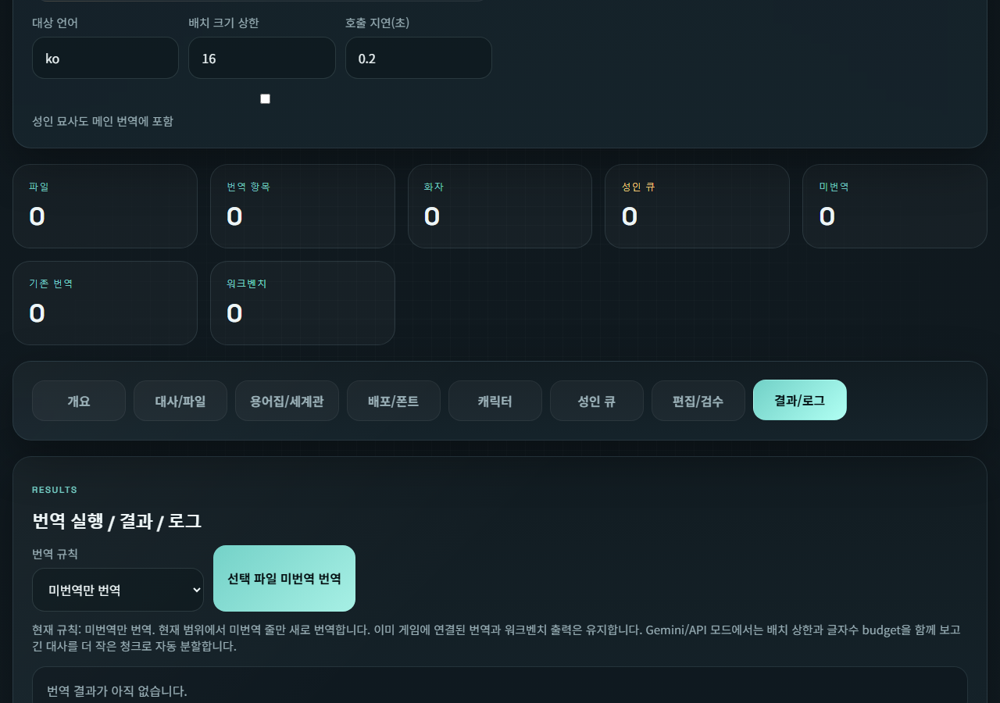

# Ren'Py Translation Workbench

Ren'Py 게임용 AI 번역 작업대입니다. 캐릭터별 말투 설정, 세계관/용어집 관리, 성인 큐 분리 검수, 수동 편집, Ren'Py 적용용 출력 생성까지 한 화면에서 다룰 수 있습니다.
*AI-assisted translation workbench for Ren'Py projects with character-aware tone controls, world and glossary management, adult-queue review, manual editing, and direct Ren'Py-ready output generation.*

라이선스 (License): Apache-2.0  
저작권 (Copyright): Copyright (c) 2026 cyy1133

## 릴리즈 개요 (Release Summary)

- 선택한 게임 `.exe` 기준으로 Ren'Py 스크립트를 분석합니다. / *Scans a Ren'Py game from the selected `.exe` and extracts translatable script blocks.*
- `translation_layer` 모드(`game/tl/<lang>`)와 원본 스크립트 fallback 모드(`game/*.rpy`)를 모두 지원합니다. / *Supports both `translation_layer` mode and source fallback mode.*
- 대사를 캐릭터별로 묶고, 역할/말투/메모/세계관/보호 용어/용어집 규칙을 조정할 수 있습니다. / *Groups dialogue by character and lets you tune role, tone, notes, world settings, protected terms, and glossary rules.*
- 전체 번역 전에 샘플 말투 미리보기를 제공합니다. / *Provides sample tone previews before full translation.*
- 성인 묘사 라인은 별도 큐로 분리해 검수하거나 직접 번역할 수 있습니다. / *Separates adult-sensitive lines into a dedicated review queue.*
- 수동 편집한 번역문을 게임 출력에 바로 반영할 수 있습니다. / *Lets you manually edit translated lines and apply them back to the game immediately.*
- 필요 시 Ren'Py 언어 팩 형태의 publish bundle까지 생성합니다. / *Generates workbench output and a publishable Ren'Py language bundle.*

## 기본 사용 흐름 (Main Workflow)

1. `Start.bat` 실행 / *Launch `Start.bat`*
2. `WebUI.HTML` 열기 / *Open `WebUI.HTML`*
3. 게임 `.exe`를 선택하거나 경로를 붙여넣기 / *Select the game `.exe` or paste the executable path*
4. `게임 분석` 실행 / *Run the `Analyze Game` action*
5. 탭별로 상태 확인 / *Review the tabs:*
   - `개요 (Overview)`: 프로젝트 추정 요약 / *overall project inference*
   - `대사/파일 (Dialogs / Files)`: 파일 범위와 대사 미리보기 / *file list and dialogue preview*
   - `용어집/세계관 (Glossary / World)`: 용어집, 보호 용어, 세계관 메모 / *glossary, protected terms, world notes*
   - `배포/폰트 (Publish / Fonts)`: 언어 코드와 폰트 매핑 / *publish language and font plan*
   - `캐릭터 (Characters)`: 캐릭터별 말투/역할 조정 / *character roster, tone presets, and sample preview workflow*
   - `성인 큐 (Adult Queue)`: 성인 묘사 분리 검수 / *adult-sensitive lines separated for review*
   - `편집/검수 (Editor / QA)`: 원문/번역문 나란히 편집 / *source/translation side-by-side editor*
   - `번역 시작 & 로그 (Start Translation & Logs)`: 번역 결과, 체크포인트, 로그 / *translation results, checkpoints, and runtime logs*
6. 전체 번역을 돌리거나, 필요한 줄만 수동 편집 / *Start translation or review lines manually*

## 기능 가이드 및 스크린샷 (User Guide & Screenshots)

각 탭이 어떤 식으로 동작하고 설정되는지 상세히 설명합니다. 작업 내용을 잃지 않고 언제든 탭 사이를 자유롭게 이동하며 설정할 수 있습니다.
*The following walkthrough details how each part of the Ren'Py Translation Workbench operates. You can seamlessly switch between tabs without losing your progress.*

### 1. 개요 및 API 설정 (Overview & API Settings)

번역 환경을 설정하고 프로젝트를 분석하는 시작점입니다. / *The Overview tab is the starting point for setting up your environment.*
- **API 설정 (API Configuration):** Google Gemini 또는 OpenAI 중 하나를 선택하고 인증 정보를 저장합니다. 현재 저장된 키 상태를 직관적으로 확인할 수 있습니다. / *Select your AI provider and securely enter your API key.*
- **빠른 번역 모드 (Quick Modes):** '추천 품질', '저비용 모드', '문체 실험' 등 원클릭 프리셋을 제공하여 배치 크기, 딜레이 시간 등을 한 번에 설정합니다. / *Offers one-click presets to automatically configure batch sizes, delays, and models.*
- **게임/입력 소스 (Source Selection):** 번역할 게임의 `.exe` 실행 파일을 등록하거나 `.rpy` 파일들을 직접 업로드하여 스크립트 블록을 추출합니다. / *Input the path to the game's `.exe` or upload extracted `.rpy` files. Clicking "Analyze Game" extracts the script blocks.*

- **AI 기본 추정 (AI Inference):** 분석 직후 대본을 기준으로 세계관, 번역 톤, 형식 규칙, 캐릭터 말투 기본값을 자동으로 채웁니다. / *After analysis, the AI automatically infers the project-level world setting, tone, and formatting rules based on the script.*

### 2. 대사 / 파일 (Dialogs / Files)

현재 프로젝트의 파일 범위와 텍스트를 파악하는 공간입니다. / *This tab gives you a granular view of the project's payload.*
- **파일 선택 (File Selection):** 프로젝트 내 여러 `.rpy` 파일 중 실제로 번역을 돌릴 파일만 체크하여 범위를 지정할 수 있습니다. / *Pick specific `.rpy` files you want to include in the active translation batch.*
- **대사 미리보기 (Dialogue Preview):** 번역 전 원문 대사가 어떻게 생겼는지, 어떤 문맥에서 나오는지 미리 훑어볼 수 있습니다. / *Browse the extracted lines to review the context and source text before passing it to the AI.*
- **진행 통계 (Scope View):** 미번역 항목과 이미 번역된 항목, 워크벤치에서 번역한 항목의 수를 한눈에 비교합니다. / *Shows exactly how many dialogues are un-translated compared to those translated by the game or by the workbench.*

### 3. 세계관 / 용어집 설정 (Glossary / World)

게임 내내 일관적인 번역 품질을 유지하기 위한 핵심 설정 탭입니다. / *A critical tab to maintain translation consistency across massive scripts.*
- **세계관 설명 (World Rules):** "근대풍 시대극 / 해안 농촌/소도시 분위기"와 같이 배경이나 분위기를 적어두면 AI가 매 프롬프트마다 이 세계관을 의식하여 번역합니다. / *Input background era and overall themes so the AI incorporates these notes into every translation prompt.*
- **전반 톤 메모 & 형식 보존 규칙 (Tone & Formatting):** 촌락/해안 지역 특유의 소박한 생활감을 살리라거나, Ren'Py 태그와 변수는 그대로 유지하라는 등의 전반적인 지침을 설정합니다. / *Set overall tone guidelines (e.g., preserving local rustic dialect) and formatting preservation rules.*
- **보호/음차 대상 및 용어집 (Protected Terms & Glossary):** 인명(Grace, Marion 등)이나 고유명사 목록을 등록해 오역을 방지하고, 특정 단어의 일관된 번역 매핑(번역/음차)을 지시합니다. / *List character names or locations that the AI should never translate, and define specific source-to-target word mappings.*

### 4. 배포 / 폰트 (Publish / Fonts)

번역판을 게임 내에서 즉시 테스트할 수 있도록 출력 옵션을 다루는 탭입니다. / *If you use the `translation_layer` mode, you can configure how the result looks in-game.*
- **언어 팩 (Bundle Options):** `ko_workbench` 같은 언어 코드와 표시 이름을 지정해 Ren'Py 구조에 맞는 방대한 `tl` 폴더를 자동 생성합니다. / *Set the language code to generate a fully formatted Ren'Py language pack `tl` folder.*
- **폰트 프리셋 기능 (Font Presets):** 다양한 한글 폰트 조합 프리셋을 기본 내장하여 클릭 한 번에 대사, 이름, 버튼, 시스템 UI의 폰트가 자동 세팅됩니다. / *Built-in font coordination presets automatically map appropriate Korean fonts with one click.*
- **크기 자동 보정 (Font Scaling):** 기존 영문 폰트와 새로 입힐 폰트 크기를 비교하여 텍스트 박스를 벗어나지 않도록 대사/이름/UI별 세밀한 배율(예: 0.96, 0.94)을 직접 설정할 수 있습니다. / *Automatically calculate target font scale comparing it against the original font so text bounds aren't broken.*

### 5. 캐릭터 추정 성격 / 말투 작업대 (Characters Workbench)

등장인물마다 개성 있는 말투를 부여할 수 있습니다. / *This workbench isolates character speech so you can tailor the AI's persona.*
- **AI의 역할 및 말투 추정 (AI Persona Inference):** 분석 직후 AI가 캐릭터의 서사적 비중과 성격 뉘앙스를 자동 추론해 제시합니다. / *After analysis, the AI automatically infers the character's narrative importance and tonal nuance.*
- **말투 프리셋 및 번역 메모 (Tone Presets & Notes):** "차갑고 직설적", "유혹적 / 장난스럽게" 등의 톤을 선택하고, 타 캐릭터와의 관계나 수위 유지에 대한 세밀한 지침을 기록합니다. / *Apply pre-defined tones and append manual notes for specific characters.*
- **미리보기 보정 (Sample Tuning):** 수천 줄을 번역하기 전 대표 문장만 뽑아 "이 캐릭터만 재번역"하며 말투를 확정할 수 있어 비용과 시간을 절약합니다. / *Retranslate only 5-6 sample lines to test the preset before committing to the full translation.*

### 6. 성인 대사 분리 영역 (Adult Queue)

검열 및 안전성을 위한 성인/민감 콘텐츠 분리 구역입니다. / *A safety and compliance feature.*
- **의도적 격리 (Isolated Lines):** 특정 키워드가 포함된 대사는 AI API로 넘기지 않고 이 탭으로 따로 빼둡니다. / *Any dialogue triggering adult-content keywords is separated from the main AI batch.*
- **전후 문맥 파악 및 수동 번역 (Context & Manual Overview):** 격리된 라인의 전/후 문맥을 확인하며 적절한 번역을 하단 에디터에 직접 입력 후 저장할 수 있습니다. / *Safely review sensitive lines alongside context, manually translate them, and save directly to bypass AI censorship filters.*

### 7. 편집 / 검수 (Editor / QA)

AI가 번역한 결과물이나 기존 스크립트를 나란히 열어놓고 수동 교정하는 탭입니다. / *A built-in side-by-side translation editor.*
- **실시간 수정 (Live Updating):** 좌우로 나뉜 원문/번역문 에디터에서 자유롭게 텍스트를 손볼 수 있습니다. / *Open any `.rpy` file and see the source text next to its translation.*
- **필터링 기능 (Status Filters):** '미번역만', '성인 큐만' 등 꼭 필요한 데이터만 띄워서 검색/조회합니다. / *Show only missing translations, or filter by adult queue and AI-generated lines.*
- **즉시 반영 (Immediate Save):** "변경 저장"을 누르는 순간 게임 폴더의 staging 파일에 결과가 덮어씌워지므로 QA가 훨씬 빠릅니다. / *Saving a row updates the staging files immediately, making QA directly impactful without re-running scripts.*

### 8. 번역 시작 & 로그 (Start Translation & Logs)

모든 준비를 마치고 실제 번역 API를 호출하는 탭입니다. / *The operational heart for running the actual translation jobs.*
- **번역 모드 (Rule Selection):** 미번역 항목만 번역할지, 기존 번역을 무시하고 전체 재번역할지 선택합니다. / *Choose whether to translate only missing strings or force a total re-translation.*
- **실시간 로깅 (Live Logging):** 진행률, API 호출 지연, 에러 현황, 남은 예산 등을 생생하게 보여줍니다. / *Monitor the batch progress, API latency, retries, and errors in real time.*

## 캐릭터 말투 보정 흐름 (Character Tone Workflow)

가장 빠른 보정 루프는 캐릭터 샘플 미리보기 중심입니다: / *The fastest correction loop is built around sample previews:*

1. `캐릭터` 탭에서 캐릭터 선택 / *Open a character in the `Characters` tab.*
2. 추출된 샘플 대사 확인 / *Review the extracted sample lines.*
3. 현재 프리셋과 대안 프리셋 비교 / *Compare the current preset against alternatives.*
4. 전체 번역 전에 샘플 미리 번역 실행 / *Run sample preview translation before committing to a full pass.*
5. 샘플 결과가 만족스러우면 본번역 진행 / *Confirm the tone only after the preview lines feel right.*
6. 선택한 파일들 번역 실행 / *Translate the selected files.*

이 방식이 전체 번역 후 대량 재번역하는 것보다 더 빠르고 비용도 적게 듭니다. / *This is usually cheaper and faster than translating everything first and redoing large batches later.*

## 수동 검수 / 수동 편집 (Manual Review and Editing)

### 성인 큐 (Adult Queue)
- 성인 분류기나 워크플로 규칙에 의해 분리된 줄을 보여줍니다. / *Shows lines flagged by the adult-content classifier or separated by workflow rules.*
- 원문, 문맥, 현재 연결 번역, 직접 입력 textarea를 제공합니다. / *Displays source text, context, current connected translation, and a direct-edit textarea.*
- `편집 탭에서 열기`로 같은 줄을 편집/검수 탭에서 바로 열 수 있습니다. / *`Open in Editor` jumps to the same item in the file editor.*
- `이 줄 저장`으로 현재 워크벤치 출력에 즉시 저장합니다. / *`Save This Line` writes the manual translation to the current workbench output immediately.*

### 편집 / 검수 탭 (Editor / QA Tab)
- 파일 단위로 원문/번역문을 나란히 보여줍니다. / *Opens a file as a source/translation pair view.*
- 상태별 필터링이 가능합니다. / *Supports filtering by translation state.*
- 원문, 연결 번역, 편집 번역문을 함께 확인할 수 있습니다. / *Keeps source text, connected translation, and editable translation visible.*
- `현재 줄 저장`은 한 줄만 저장합니다. / *`Save Current Line` writes one row.*
- `변경 저장`은 현재 파일의 수정된 줄을 한 번에 저장합니다. / *`Save Changes` writes all dirty rows in the current file.*

## 번역 규칙 (Translation Modes)

### 새 번역 (New Translation)
현재 범위에서 미번역 줄만 번역합니다. / *Translate only untranslated lines in the current scope.*

### 재번역 (Retranslation)
이미 번역된 줄만 다시 번역합니다. 어투 보정이나 품질 재작업에 적합합니다. / *Re-run existing translated lines only. This is useful for tone upgrades or character-specific rewriting.*

### 전체 재작성 (Force All)
선택 범위 전체를 새로 번역합니다. / *Translate the whole selected scope again from scratch.*

### 특정 캐릭터 재번역 (Character-only Retranslation)
선택된 파일 범위 안에서 특정 캐릭터 대사만 다시 번역합니다. / *Retranslate only one selected character across the currently selected files.*

## 지원 공급자 (Provider Support)

### Gemini API
- 기본 추천: `gemini-2.5-flash` / *Recommended default: `gemini-2.5-flash`*
- 저비용 모드: `gemini-2.5-flash-lite` / *Budget mode: `gemini-2.5-flash-lite`*
- 항목 수와 글자 수를 함께 보는 동적 청크 전략 사용 / *Dynamic chunking uses both item-count and character-budget planning.*

### OpenAI OAuth / Codex CLI
- UI에 API 키를 직접 넣지 않아도 Codex CLI로 실행 가능 / *Supports local Codex CLI execution without API key entry in the UI.*
- 체크포인트와 재개 메타데이터 지원 / *Includes automatic checkpointing and resume metadata.*
- 장문 대본용 문서 단위 청크 최적화 지원 / *Uses larger document-aware chunking for cheaper long-form jobs.*

## 출력 경로 (Output Layout)

### translation_layer 모드 (Translation Layer Mode)
- staging 출력: `game/tl/<lang>_ai/...`
- publish bundle: `game/tl/<publish_language_code>/...`
- publish 설정 파일: `zz_workbench_language_config.rpy`

### 원본 스크립트 fallback 모드 (Source Fallback Mode)
- workbench 출력: `game/_translator_output/<lang>_source/...`
- 성인 검토 큐: `adult_review.json`
- 번역 로그: `game/_translator_logs/{analysis_mode}/{lang}/{session_id}/...`

## 저장소 구성 (Repository Notes)

- `RBackend.py`: 분석, 공급자 연동, 번역 파이프라인, 수동 편집 라우트 / *backend analysis, provider integration, translation pipeline, manual-edit routes*
- `WebUI.HTML`: 전체 UI 레이아웃과 탭 구조 / *app shell and tab layout*
- `webui.js`: 상태 관리, 상호작용, 샘플 미리보기, 수동 편집 로직 / *state management, interaction logic, sample preview flow, manual-edit flow*
- `webui.css`: 반응형 스타일과 작업대 UI / *responsive layout and workbench styling*
- `docs/screenshots/` 및 `docs/images/`: 릴리즈용 스크린샷 / *release screenshots used in this README*

## 라이선스 (License)

이 프로젝트는 Apache License 2.0으로 배포됩니다. 자세한 내용은 [LICENSE](LICENSE)와 [NOTICE](NOTICE)를 참고하세요.
*This project is released under the Apache License 2.0. See [LICENSE](LICENSE) and [NOTICE](NOTICE).*
