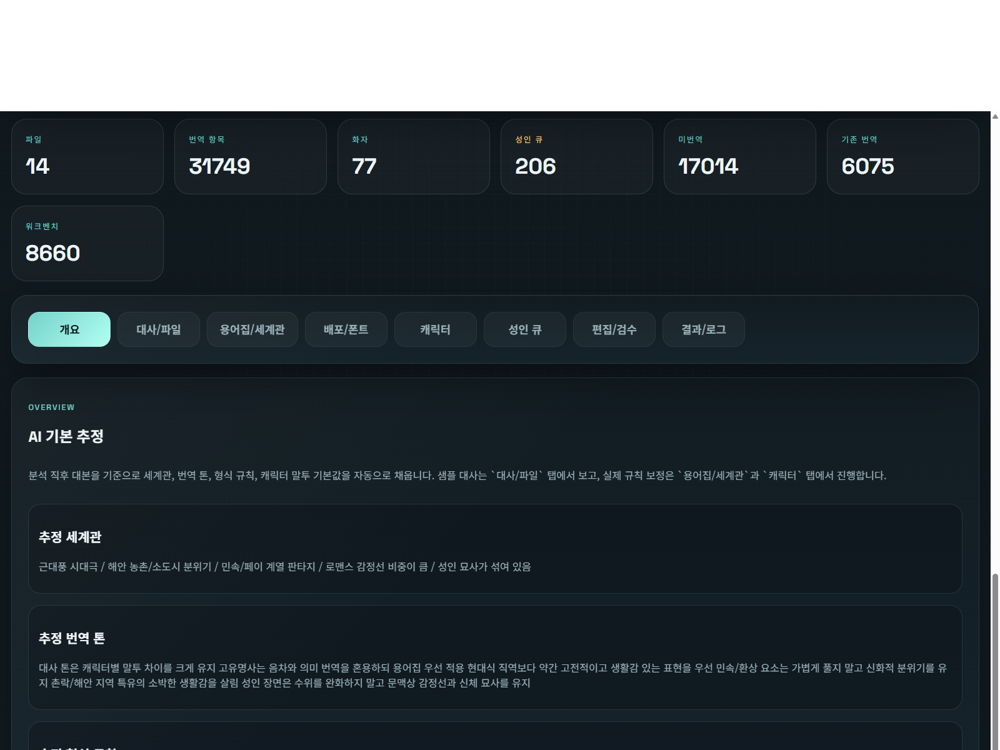
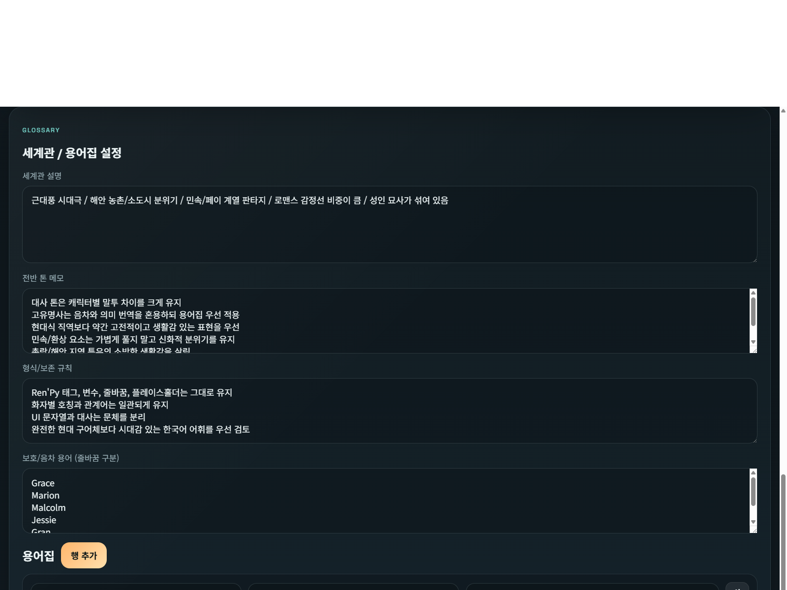
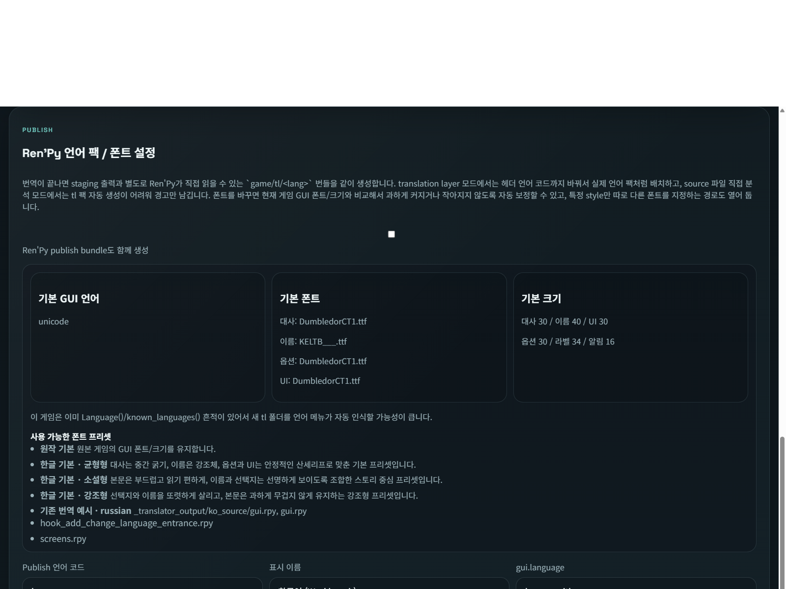
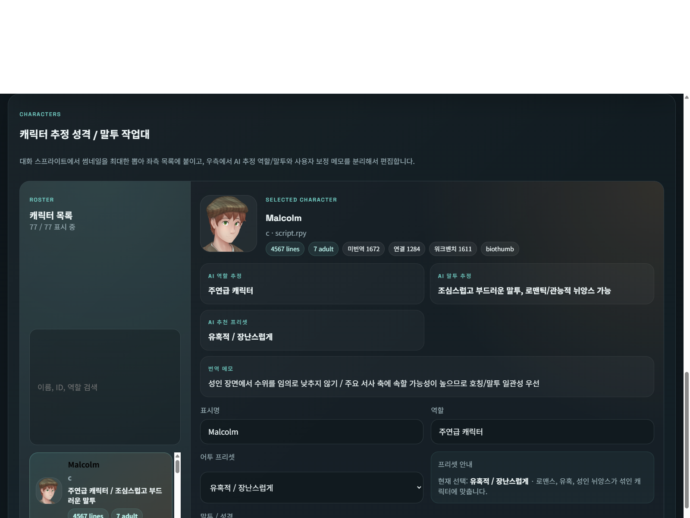
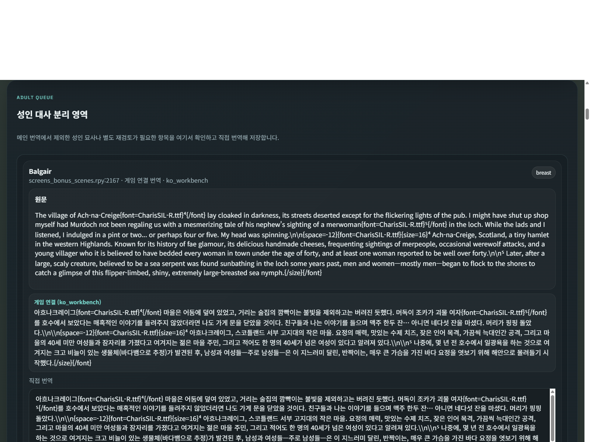
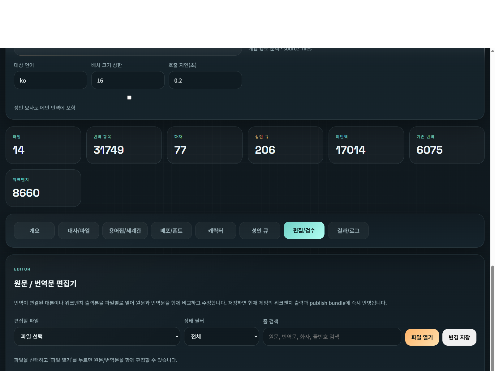
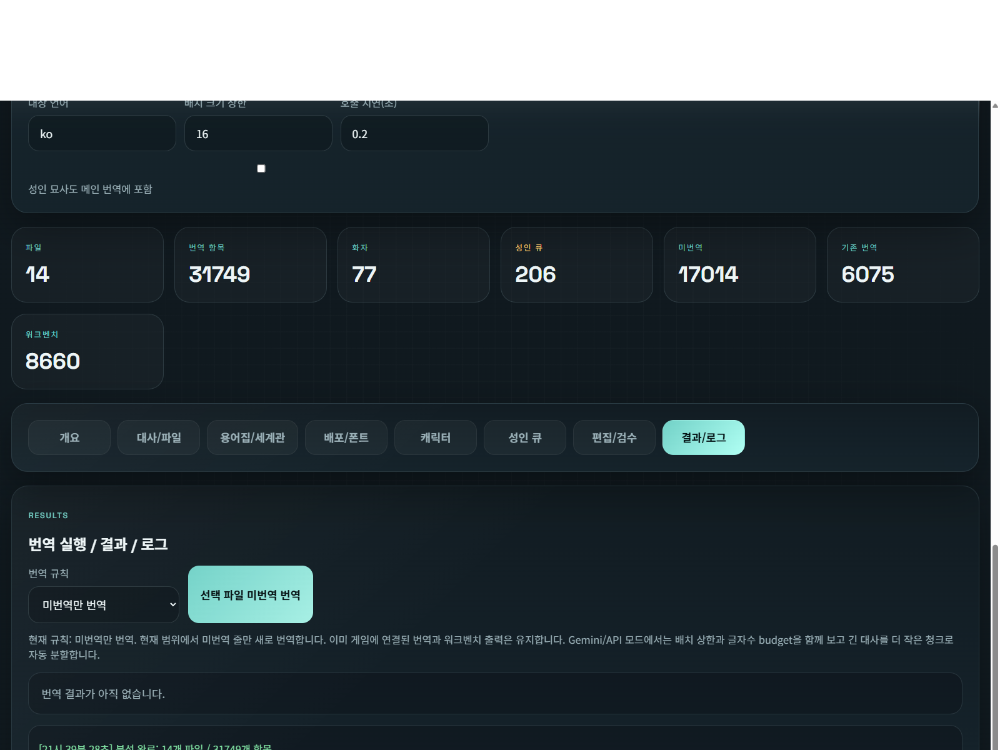

# Ren'Py Translation Workbench

AI-assisted translation workbench for Ren'Py projects with character-aware tone controls, world and glossary management, adult-queue review, manual editing, and direct Ren'Py-ready output generation.

Korean documentation: [README.ko.md](README.ko.md)

License: Apache-2.0  
Copyright (c) 2026 cyy1133

## Release Summary

- Scans a Ren'Py game from the selected `.exe` and extracts translatable script blocks.
- Supports both `translation_layer` mode (`game/tl/<lang>`) and source fallback mode (`game/*.rpy`).
- Groups dialogue by character and lets you tune role, tone, notes, world settings, protected terms, and glossary rules.
- Provides sample tone previews before full translation.
- Separates adult-sensitive lines into a dedicated review queue.
- Lets you manually edit translated lines and apply them back to the game immediately.
- Generates workbench output and, when supported, a publishable Ren'Py language bundle.

## Main Workflow

1. Launch `Start.bat`.
2. Open `WebUI.HTML`.
3. Select the game `.exe` or paste the executable path.
4. Run the `Analyze Game` action.
5. Review the tabs:
   - `Overview`: overall project inference
   - `Dialogue / Files`: file list and dialogue preview
   - `Glossary / World`: glossary, protected terms, world notes
   - `Publish / Fonts`: publish language and font plan
   - `Characters`: character roster, tone presets, and sample preview workflow
   - `Adult Queue`: adult-sensitive lines separated for review
   - `Editor / QA`: source/translation side-by-side editor
   - `Results / Logs`: translation results, checkpoints, and runtime logs
6. Start translation or review lines manually.

## Screenshots

The screenshots below were captured from a live work-in-progress session without stopping the running backend process.

### Overview

Project-level summary, inferred world setting, tone defaults, and format rules.

### Dialogue / Files

File-level scope selection, translation rule control, and dialogue preview across the currently analyzed script set.

### Glossary / World

Global world notes, protected terms, glossary entries, and provider-facing translation guidance.

### Publish / Fonts

Ren'Py language bundle settings, language code selection, and per-area font mapping for dialogue, names, choices, UI, and system text.

### Character Workbench

Character roster, thumbnails, role and tone notes, preset selection, and prompt tuning per speaker.

### Adult Queue

Adult-sensitive or separately reviewed lines are isolated here. You can review the source, inspect the connected translation, and type a manual translation directly.

### Editor / QA

A dedicated source/translation editor for connected or workbench-translated files. Saving applies the edits directly to the current game output.

### Results / Logs

Translation session status, per-file results, checkpoints, and runtime logging for long-running jobs.

## Character Tone Workflow

The fastest correction loop is built around sample previews:

1. Open a character in the `Characters` tab.
2. Review the extracted sample lines.
3. Compare the current preset against alternatives.
4. Run sample preview translation before committing to a full pass.
5. Confirm the tone only after the preview lines feel right.
6. Translate the selected files.

This is usually cheaper and faster than translating everything first and redoing large batches later.

## Manual Review and Editing

### Adult Queue

- Shows lines flagged by the adult-content classifier or separated by workflow rules.
- Displays source text, context, current connected translation, and a direct-edit textarea.
- `Open in Editor` jumps to the same item in the file editor.
- `Save This Line` writes the manual translation to the current workbench output immediately.

### Editor / QA Tab

- Opens a file as a source/translation pair view.
- Supports filtering by translation state.
- Keeps source text, connected translation, and editable translation visible.
- `Save Current Line` writes one row.
- `Save Changes` writes all dirty rows in the current file.

## Translation Modes

### New Translation

Translate only untranslated lines in the current scope.

### Retranslation

Re-run existing translated lines only. This is useful for tone upgrades or character-specific rewriting.

### Force All

Translate the whole selected scope again from scratch.

### Character-only Retranslation

Retranslate only one selected character across the currently selected files.

## Provider Support

### Gemini API

- Recommended default: `gemini-2.5-flash`
- Budget mode: `gemini-2.5-flash-lite`
- Dynamic chunking uses both item-count and character-budget planning

### OpenAI OAuth / Codex CLI

- Supports local Codex CLI execution without API key entry in the UI
- Includes automatic checkpointing and resume metadata
- Uses larger document-aware chunking for cheaper long-form jobs

## Output Layout

### Translation Layer Mode

- Staging output: `game/tl/<lang>_ai/...`
- Publish bundle: `game/tl/<publish_language_code>/...`
- Publish config: `zz_workbench_language_config.rpy`

### Source Fallback Mode

- Workbench output: `game/_translator_output/<lang>_source/...`
- Adult review queue: `adult_review.json`
- Translation logs: `game/_translator_logs/{analysis_mode}/{lang}/{session_id}/...`

## Repository Notes

- `RBackend.py`: backend analysis, provider integration, translation pipeline, manual-edit routes
- `WebUI.HTML`: app shell and tab layout
- `webui.js`: state management, interaction logic, sample preview flow, manual-edit flow
- `webui.css`: responsive layout and workbench styling
- `docs/screenshots/`: release screenshots used in this README

## License

This project is released under the Apache License 2.0. See [LICENSE](LICENSE) and [NOTICE](NOTICE).
