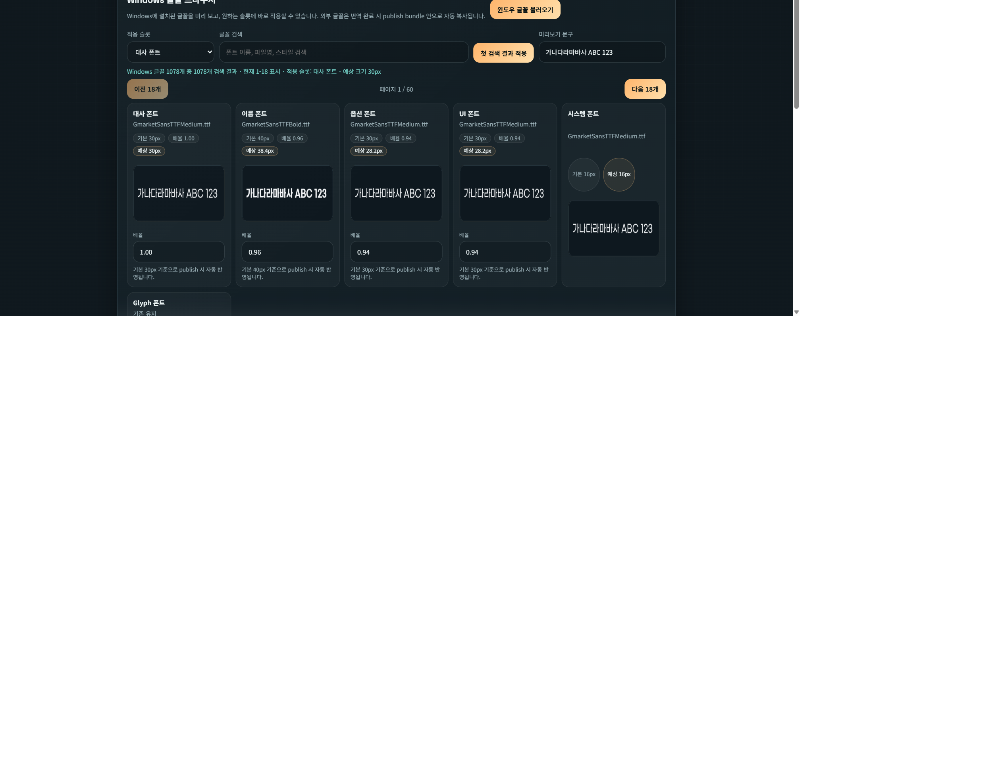

# Windows 글꼴 브라우저 / 폰트 적용 가이드

Ren'Py Translation Workbench의 `배포/폰트` 탭에서 Windows 설치 글꼴을 미리 보고, 슬롯별 크기를 조정하고, 번역 완료 시 Ren'Py publish bundle에 자동 포함시키는 방법을 설명합니다.  
*This guide explains how to preview installed Windows fonts, tune slot-specific sizing, and publish those fonts into the Ren'Py bundle from the `Publish / Fonts` tab.*

## 1. 이 탭이 하는 일

- 번역 결과를 Ren'Py 언어 팩(`game/tl/<lang>`)으로 쓸 때 폰트를 같이 설정합니다. / *Configures fonts when you publish the translation into a Ren'Py language pack (`game/tl/<lang>`).*
- Windows에 설치된 글꼴을 바로 골라 쓸 수 있습니다. / *Lets you pick from fonts installed on Windows.*
- 외부 시스템 글꼴을 선택하면 publish 시 `_workbench_fonts` 안으로 자동 복사합니다. / *If you select an external system font, the app copies it into `_workbench_fonts` when publishing.*

## 2. 슬롯 개념 이해하기

이 탭은 글꼴을 한 종류만 고르는 구조가 아니라, 사용 위치별 슬롯으로 나눠 관리합니다.  
*Fonts are managed per UI slot rather than as a single global font.*

기본 슬롯:
- `대사 폰트`
- `이름 폰트`
- `옵션 폰트`
- `UI 폰트`
- `시스템 폰트`
- `Glyph 폰트`

보통은 다음처럼 생각하면 쉽습니다.  
*A practical mental model looks like this.*

- 대사 폰트: 일반 본문
- 이름 폰트: 이름 박스, 화자 표시
- 옵션 폰트: 선택지 버튼
- UI 폰트: 설정창, 버튼, 설명
- 시스템 폰트: 작은 라벨/상태 텍스트
- Glyph 폰트: 일부 특수 기호/문자 보조

## 3. 슬롯별 미리보기 카드 읽는 법

상단 카드들은 현재 publish 설정을 한눈에 보여줍니다.  
*The top cards summarize the current publish plan at a glance.*

각 카드에서 보이는 항목:
- `기본 30px` 같은 값: 원래 게임 GUI 기준 기본 크기
- `배율 0.94`: 사용자가 적용한 scale
- `예상 28.2px`: publish 시 최종 반영 예상 크기
- 프리뷰 이미지: 현재 슬롯 기준으로 렌더된 실제 글꼴 느낌

즉, `기본 크기 x 배율 = 예상 적용 크기`입니다.  
*In practice: `base size x scale = predicted applied size`.*

## 4. Windows 글꼴 브라우저 사용 흐름

### 4-1. 글꼴 불러오기

`윈도우 글꼴 불러오기`를 누르면 설치된 글꼴 목록을 읽습니다.  
*Click `윈도우 글꼴 불러오기` to read the installed Windows font library.*

### 4-2. 적용 슬롯 고르기

`적용 슬롯`에서 지금 바꿀 대상을 고릅니다.  
*Choose the slot you want to edit first.*

예:
- 대사만 바꾸고 싶으면 `대사 폰트`
- 이름만 강조하고 싶으면 `이름 폰트`

### 4-3. 검색과 페이지 이동

- `글꼴 검색`으로 이름, 파일명, 스타일을 검색
- `첫 검색 결과 적용`으로 가장 위 결과를 즉시 적용
- `이전 18개 / 다음 18개`로 전체 글꼴을 페이지 단위 탐색

이 앱은 한 번에 `18개` 카드씩 보여주도록 맞춰져 있습니다.  
*The browser shows 18 cards per page.*

### 4-4. 카드 적용

글꼴 카드마다:
- 미리보기 이미지
- 글꼴명 / 스타일 / 파일명
- `이 슬롯 적용 예상 크기`
- 적용 버튼

이 있어서, 원하는 카드의 버튼을 바로 누르면 현재 선택된 슬롯에 반영됩니다.  
*Each card can be applied directly to the currently selected slot.*

## 5. 크기 조정은 어떻게 보는가

폰트마다 같은 `30px`라도 실제 시각 크기는 다릅니다.  
*Different fonts can look dramatically different even at the same nominal pixel size.*

그래서 이 앱은:
- 게임의 원래 폰트 기준 크기를 읽고
- 새 글꼴의 bbox/미리보기 기준으로
- `배율`과 `예상 적용 크기`를 보여줍니다

실무적으로는 아래처럼 보면 편합니다.

- 너무 작다: 배율을 `1.00 -> 1.08`처럼 조금 올림
- 너무 크다: 배율을 `1.00 -> 0.92`처럼 조금 내림
- 이름만 더 도드라지게: 이름 슬롯 배율만 조정

## 6. 추천 운영 패턴

### 패턴 A. 기본 프리셋에서 소폭 조정

1. `한글 기본 · 균형형` 같은 프리셋 적용
2. Windows 글꼴 브라우저에서 대사 폰트만 교체
3. 슬롯 카드에서 예상 크기 확인
4. 너무 크면 배율을 조금 낮춤

### 패턴 B. 이름과 선택지만 강조

1. 대사는 읽기 편한 중간 굵기
2. 이름은 굵은 글꼴
3. 옵션은 또렷한 산세리프
4. UI는 과하게 튀지 않는 기본형 유지

### 패턴 C. 폰트만 다시 적용

이미 번역은 끝났는데 글꼴만 바꾸고 싶다면:

1. `배포/폰트` 탭에서 폰트와 배율 수정
2. `폰트만 다시 적용` 버튼 클릭

이 경우 번역문 자체는 다시 생성하지 않고, publish용 폰트 설정과 자산만 다시 반영합니다.  
*`폰트만 다시 적용` updates only the published font assets/config without retranslating the script.*

## 7. 외부 시스템 글꼴이 publish에 포함되는 방식

Windows 시스템 글꼴은 원래 게임 폴더 안에 없을 수 있습니다.  
*Windows system fonts do not normally live inside the game folder.*

그래서 publish 시:
- 선택한 외부 글꼴 파일을 찾고
- `tl/<publish_lang>/_workbench_fonts/`로 복사하고
- language config에서 그 경로를 참조합니다

즉, 다른 PC에서도 번역판이 같은 글꼴을 재현할 수 있도록 패키징됩니다.  
*This lets the translated build reproduce the same typography on another machine.*

## 8. 자주 생기는 문제와 해결

### 문제 1. 글꼴은 예쁜데 실제 게임에서 너무 작다

- 해당 슬롯 카드의 `배율`을 올립니다.
- 특히 `시스템 폰트`와 `UI 폰트`는 기본 크기가 작아서 눈에 띄기 어렵습니다.

### 문제 2. 일부 한글이 깨진다

- 그 글꼴이 한글 glyph를 충분히 지원하지 않을 수 있습니다.
- `Glyph 폰트`를 한글 지원 폰트로 별도 지정하는 방법이 있습니다.

### 문제 3. 이름은 괜찮은데 선택지가 작다

- `옵션 폰트` 슬롯만 별도로 조정합니다.
- `옵션 크기 배율` 또는 슬롯 카드 배율을 따로 손보면 됩니다.

### 문제 4. 폰트를 바꿨는데 번역을 다시 돌려야 하나

아닙니다. `폰트만 다시 적용`으로 해결되는 경우가 많습니다.  
*Usually no. `폰트만 다시 적용` is enough.*

## 9. README와 함께 보면 좋은 문서

- [README.md](../../README.md)
- [Vertex AI / Google Cloud 무료 크레딧 가이드](vertex-ai-google-cloud-credits.md)

## 10. 실전 체크리스트

배포 전 마지막으로 아래를 확인하면 안정적입니다.  
*Run through this checklist before shipping a translated build.*

1. 슬롯별 프리뷰 카드에서 예상 px 확인
2. 대사/이름/옵션/UI가 각각 너무 크거나 작지 않은지 확인
3. Windows 시스템 글꼴을 썼다면 `_workbench_fonts` 복사 대상이 생기는지 확인
4. `폰트만 다시 적용` 후 게임에서 실제 텍스트 박스가 넘치지 않는지 확인
